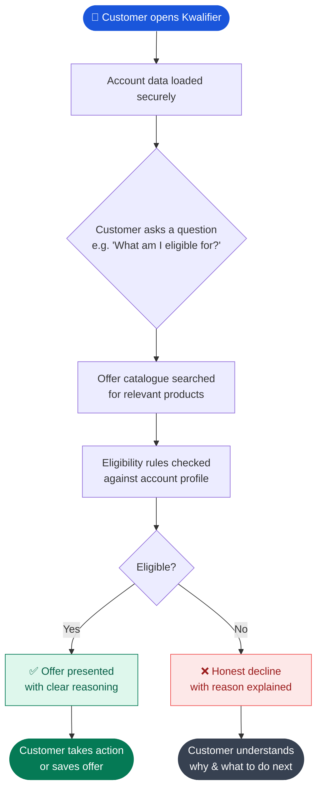

# 🏦 Kwalifier

> **"What am I actually eligible for?"** — Kwalifier answers that question instantly, honestly, and only with what the bank actually offers.

---

## What Is Kwalifier?

Kwalifier is an AI-powered eligibility assistant built for bank customers. It cuts through the noise of generic marketing and tells each customer — based on *their own account data* — exactly which offers, benefits, and products they qualify for right now.

Most bank apps surface the same promotions to everyone. Kwalifier does the opposite: it reads the bank's official offer catalogue and cross-references it against a customer's real account profile to deliver a **precise, personalised eligibility verdict** — no guesswork, no upselling, no hallucination.

Think of it as the knowledgeable banker who has read every policy document and actually knows your account inside out.

---

## The Problem It Solves

Bank customers regularly miss out on credit limit upgrades, cashback offers, loyalty rewards, and fee waivers — not because they don't qualify, but because they never knew to ask, or got a vague answer when they did.

Traditional customer service channels are slow, inconsistent, and often unable to provide real-time eligibility answers. Kwalifier closes that gap.

**Kwalifier is not a general financial advisor.** It never speculates beyond what is explicitly stated in the retrieved offer documents and the eligibility verdict data it receives. That constraint is a feature, not a limitation — it makes every answer trustworthy and auditable.

---

## How It Works

Kwalifier is built on a **Retrieval-Augmented Generation (RAG)** architecture:

1. **Account context** — The customer's own account information (tenure, product holdings, transaction history, tier) is loaded as structured data.
2. **Offer retrieval** — The bank's official offer catalogue is indexed and retrieved in real time based on the customer's profile.
3. **Eligibility reasoning** — An LLM reasons over the retrieved documents and account data to produce a structured eligibility verdict.
4. **Grounded response** — The customer receives a clear, plain-language answer citing only the offers they are genuinely eligible for.

---

## Customer Journey

---

## Core Principles

| Principle | What it means in practice |
|---|---|
| **Grounded only** | Every answer is sourced from retrieved offer documents — never fabricated |
| **Account-scoped** | Only the customer's own data is used — no cross-customer inference |
| **Honest declines** | If a customer doesn't qualify, Kwalifier says so clearly and explains why |
| **No speculation** | Kwalifier does not give general financial advice or predict future eligibility |
| **Auditable** | Every eligibility verdict can be traced back to the source document and rule |

---

## Who It's For

- **Retail bank customers** who want to understand their benefits without calling a helpline
- **Branch staff** who need a fast, reliable eligibility lookup tool
- **Product teams** building personalised banking experiences on top of existing offer catalogues

---

## Status

🚧 Active development — built by [@curiowhiz](https://github.com/curiowhiz)

---

*Kwalifier answers only what the data supports. That's the point.*
